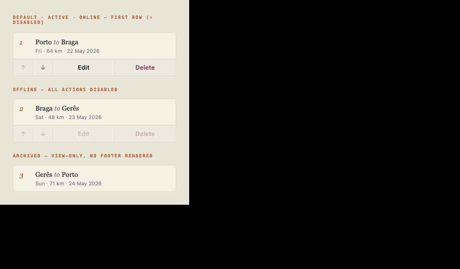

# M1 · Stage card — split tap-target + footer wrapper (mobile)

### 1 · Identity & dependencies

| ID | Title | Surface | State | Builds in | Depends on | Reuses |
|----|-------|---------|-------|-----------|------------|--------|
| M1 | Stage card split | 📱 mobile | 🔴 build | `screens/render/trip-detail/stages-mobile.js` · `styles/app-ui.css` | F0, F1 | M2 (footer), `rf-m2-open-stage` (existing) |

**Intent.** Convert each mobile Stages-list row from a single tap-button into
a **card** with a tap-body (opens the journal) plus the M2 action footer
(`↑ ↓ Edit Delete`), so reorder/edit/delete are reachable without leaving the
list.

> **🔴 Build.** Today `renderMobileStages` (`stages-mobile.js:48`) emits one
> `<button class="rf-clean-stage" data-action="rf-m2-open-stage" data-stage-id>`
> per stage. M1 wraps that into `<article class="rf-clean-stage-card">` →
> `<button class="rf-clean-stage-tap">` (same open action) + M2 footer.

---

### 2 · Tokens & metrics

| Property | Value |
|----------|-------|
| Card | reuse existing `.rf-clean-stage-card` (`interface-polish.css:29`: `border:1px solid var(--rf-m2-rule-2)`, `bg rgba(243,240,228,.58)`, radius `6px`, `padding:14px;margin:10px 0`) |
| Tap-body | grid `38px 1fr`, gap `12px`, full-width, `text-align:left`, `padding:0 0 12px` (footer sits below) |
| Numeral | serif italic `28px`, `var(--rf-m2-primary)` (matches `.rf-clean-stage>span`) |
| Title | serif `500 20px/1.12` (matches `.rf-clean-stage strong`) |

> The card must drop its own `padding` onto the tap-body + footer so the
> footer's top rule spans the full card width (M2 owns the footer border).

CSS (append to `styles/app-ui.css`, namespaced `.rf-clean-*`):

```css
.rf-clean-stage-card{padding:0;overflow:hidden}
.rf-clean-stage-tap{width:100%;display:grid;grid-template-columns:38px 1fr;gap:12px;text-align:left;padding:14px;border:0;background:transparent;color:var(--rf-m2-ink)}
.rf-clean-stage-tap>span{font:italic 28px var(--rf-m2-font-serif);color:var(--rf-m2-primary)}
.rf-clean-stage-tap strong{font:500 20px/1.12 var(--rf-m2-font-serif)}
.rf-clean-stage-tap small{display:block;color:var(--rf-m2-muted);font:11px var(--rf-m2-font-mono);letter-spacing:.07em}
.rf-clean-stage-tap p{margin:6px 0 0;color:var(--rf-m2-muted);font-size:14px}
```

---

### 3 · Markup contract

**Factory** (refactor the `.map()` body in `renderMobileStages`):

```js
const total = st.length;
// …inside st.map((stage, index) => …)
`<article class="rf-clean-stage-card">`
  + `<button class="rf-clean-stage-tap" data-action="rf-m2-open-stage" data-stage-id="${esc(stage.id)}">`
    + `<span>${index + 1}</span>`
    + `<div><strong>${esc(stage.start_location || 'Start')} <em>to</em> ${esc(stage.end_location || 'End')}</strong>`
    + `<small>${esc(day(stage.planned_date))} · ${Math.round(Number(stage.distance_km) || 0)} km · ${esc(fmtDate(stage.planned_date) || '')}</small>`
    + `${stage.notes ? `<p>${esc(stage.notes)}</p>` : ''}</div>`
  + `</button>`
  + `${stageActionFooterHtml(stage, { index, total, trip })}`   // M2
+ `</article>`
```

**DOM map**

```
article.rf-clean-stage-card
├─ button.rf-clean-stage-tap   [rf-m2-open-stage]   (numeral + title + meta)
└─ div.rf-clean-stage-foot     (M2 — omitted when showStageActions(trip) false)
```

**Anchor.** `renderMobileStages(trip,…)` in `stages-mobile.js:46-49` — replace
the `st.map(...)` button template; keep the `|| '<div class="rf-clean-empty">No stages yet.</div>'`
fallback and the trailing `+ Add another stage` dashed button.

---

### 4 · States

| State | Trigger | Visual / DOM delta |
|-------|---------|--------------------|
| Active + online | `showStageActions(trip)` true & online | card = tap-body + 4-button footer |
| Archived | `showStageActions(trip)` false | M2 returns `''` → card = tap-body only |
| Offline | `STATE.isOnline===false` | footer buttons `disabled` (M2); tap-body still opens journal |
| Empty list | `st.length===0` | `.rf-clean-empty` "No stages yet." (unchanged) |

---

### 5 · Interaction (Given/When/Then)

- **Open.** *Given* a card, *when* the tap-body is tapped, *then*
  `rf-m2-open-stage` fires (unchanged behavior: `app-actions.js` sets
  `selectedStageId`, `view='journal'`). Footer buttons are separate targets
  (M2 / H1) and do not trigger open.

---

### 6 · Data & persistence

None directly — M1 is structure. Open/edit/delete/reorder data flows belong
to the existing open handler and M2/H1.

---

### 7 · Acceptance

- [ ] Each mobile stage renders as `article.rf-clean-stage-card` with a
      `.rf-clean-stage-tap` body and (when active+online) the M2 footer.
- [ ] Tapping the body still opens the journal (no regression).
- [ ] Footer top-rule spans the full card width (card padding moved inward).
- [ ] Archived trip: cards render with **no** footer.
- **GWT:** Given an active trip with stages, When the Stages tab renders,
      Then every card shows `↑ ↓ Edit Delete` beneath the tappable summary.

### 8 · Reference image

 — the card =
tap-body + footer shown in the M2 reference (palette `midnight`).
