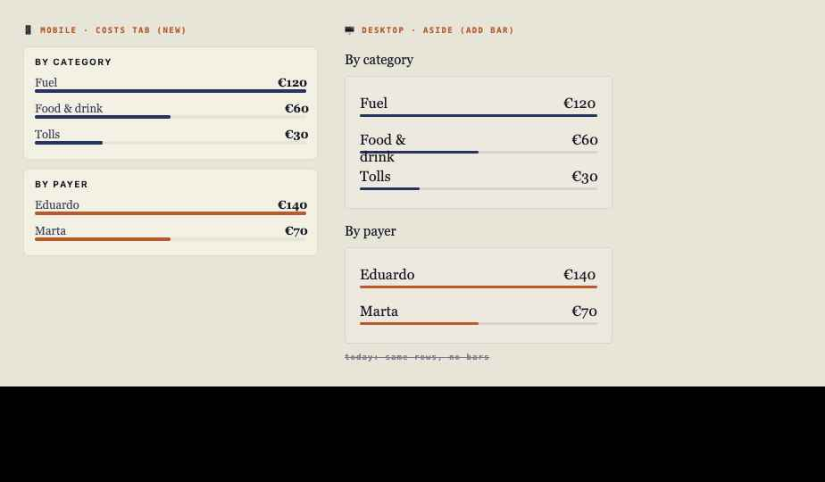

# S1 · Costs breakdown card (shared)

### 1 · Identity & dependencies

| ID | Title | Surface | State | Builds in | Depends on | Reuses |
|----|-------|---------|-------|-----------|------------|--------|
| S1 | Costs breakdown card | ♊ shared | 🟠 partial | 📱 `screens/render/trip-detail/costs-mobile.js` · 🖥 `screens/render/trip-detail/costs-desktop.js` · `styles/app-ui.css` | F0(*) | `aggregateExpense`, `fmtEuro` (`shared.js`) |

(*) F0 not strictly required (S1 uses primary/accent, both defined) — but
land F0 first per build order to keep the token set whole.

**Intent.** A reusable "breakdown" card that lists `label → amount` rows
with a **proportional bar** under each, scaled to the largest amount in the
card. Rendered twice per Costs tab: **By category** (primary bar) and
**By payer** (accent bar).

> **🟠 Partial — reconcile, don't duplicate.** Desktop already renders
> breakdowns via `breakdown(map)` in `costs-desktop.js` as
> `.rf-d2-breakdown` rows **without bars**. Mobile (`costs-mobile.js`) has
> **no breakdown at all**. S1 = (a) add the bar to desktop, (b) add the
> whole card to mobile, from one shared contract.

---

### 2 · Tokens & metrics

| Property | Mobile (`.rf-clean-breakdown`) | Desktop (`.rf-d2-breakdown`) |
|----------|-------------------------------|------------------------------|
| Card | `bg var(--rf-m2-surface)`, `1px solid var(--rf-m2-rule)`, radius `6px`, `padding:10px 12px` | existing: `1px solid var(--rf-d2-rule)`, radius `4px`, `padding:12px 16px` |
| Heading | mono `10px`/`700`, `letter-spacing:.12em`, `uppercase`, `var(--rf-m2-ink)` | existing `.rf-d2-section-title` precedes the card |
| Row | grid `1fr auto`, serif `13px`, `var(--rf-m2-ink-2)`; value `<b>` serif `13px`/`600` `var(--rf-m2-ink)` | existing `.rf-d2-break-row` flex space-between, serif `16px` |
| Bar track | `height:4px`, `bg var(--rf-m2-bg)`, radius `999px` | `height:3px`, `bg var(--rf-d2-rule)`, radius `999px` (**add**) |
| Bar fill (category) | `var(--rf-m2-primary)` | `var(--rf-d2-primary)` |
| Bar fill (payer) | `var(--rf-m2-accent)` (`.is-payer .bar>i`) | `var(--rf-d2-accent)` |

Mobile CSS (append to `styles/app-ui.css`):

```css
.rf-clean-breakdown{background:var(--rf-m2-surface);border:1px solid var(--rf-m2-rule);border-radius:6px;padding:10px 12px;margin-top:6px}
.rf-clean-breakdown>strong{display:block;font:700 10px var(--rf-m2-font-ui);letter-spacing:.12em;text-transform:uppercase;color:var(--rf-m2-ink);margin-bottom:6px}
.rf-clean-breakdown .br-row{display:grid;grid-template-columns:1fr auto;gap:8px;align-items:center;padding:4px 0 2px;font:13px var(--rf-m2-font-serif);color:var(--rf-m2-ink-2)}
.rf-clean-breakdown .br-row b{font:600 13px var(--rf-m2-font-serif);color:var(--rf-m2-ink)}
.rf-clean-breakdown .bar{height:4px;background:var(--rf-m2-bg);border-radius:999px;margin:0 0 6px;overflow:hidden}
.rf-clean-breakdown .bar>i{display:block;height:100%;background:var(--rf-m2-primary);border-radius:999px}
.rf-clean-breakdown.is-payer .bar>i{background:var(--rf-m2-accent)}
```

Desktop (extend the existing `.rf-d2-breakdown` — add only the bar):

```css
.rf-d2-breakdown .bar{height:3px;background:var(--rf-d2-rule);border-radius:999px;margin:2px 0 8px;overflow:hidden}
.rf-d2-breakdown .bar>i{display:block;height:100%;background:var(--rf-d2-primary);border-radius:999px}
.rf-d2-breakdown.is-payer .bar>i{background:var(--rf-d2-accent)}
```

---

### 3 · Markup contract

**Factory** (new shared atom, e.g. `components/atoms/costs-breakdown.js`):

```js
import { esc } from '../../utils/dom.js';
import { fmtEuro } from '../../utils/format.js';

// map: Map<label, amount> (from aggregateExpense → agg.cat / agg.payer)
// kind: 'category' | 'payer'  ·  prefix: 'rf-m2' | 'rf-d2'
export function costsBreakdownHtml(map, { kind, prefix, heading }) {
  const rows = [...map.entries()].sort((a, b) => b[1] - a[1]);
  if (!rows.length) return '';
  const max = rows[0][1] || 1;
  const isM2 = prefix === 'rf-m2';
  const cls = isM2 ? 'rf-clean-breakdown' : 'rf-d2-breakdown';
  const payer = kind === 'payer' ? ' is-payer' : '';
  const head = isM2 ? `<strong>${esc(heading)}</strong>` : '';   // desktop uses section-title above
  return `<section class="${cls}${payer}">${head}`
    + rows.map(([label, amount]) => {
        const pct = Math.round((amount / max) * 100);
        return `<div class="br-row"><span>${esc(label)}</span><b>${fmtEuro(amount)}</b></div>`
             + `<div class="bar"><i style="width:${pct}%"></i></div>`;
      }).join('')
    + `</section>`;
}
```

**Call sites**

- 📱 `renderMobileCosts` (`costs-mobile.js`): after the `.rf-clean-ledger`
  section, before `<h2>All entries</h2>`, insert:
  ```js
  ${costsBreakdownHtml(agg.cat,   { kind:'category', prefix:'rf-m2', heading:'By category' })}
  ${costsBreakdownHtml(agg.payer, { kind:'payer',    prefix:'rf-m2', heading:'By payer' })}
  ```
- 🖥 `renderCosts` (`costs-desktop.js`): replace the two inline
  `breakdown(agg.cat)` / `breakdown(agg.payer)` calls in the aside with
  `costsBreakdownHtml(agg.cat,{kind:'category',prefix:'rf-d2'})` /
  `…agg.payer,{kind:'payer',prefix:'rf-d2'}`, keeping the existing
  `.rf-d2-section-title` "By category"/"By payer" headings above each.

`agg` comes from `aggregateExpense(rows)` → `{ total, cat:Map, payer:Map }`
(already in `shared.js`).

---

### 4 · States

| State | Trigger | Visual / DOM delta |
|-------|---------|--------------------|
| Default | `map.size > 0` | Rows sorted desc by amount; bars scaled to row[0] |
| Single row | `map.size === 1` | One full-width (100%) bar |
| Empty | `map.size === 0` | Factory returns `''` (mobile) — no card. Desktop keeps its existing "No data —" row if you prefer parity (note in §7). |
| Category vs payer | `kind` | Bar fill primary vs accent (`.is-payer`) |
| Long label | label overflows | `1fr auto` grid keeps amount right-aligned; label ellipsis is acceptable, wrap is acceptable |

Presentational — **no offline/archived/disabled states** (read-only
summary). The Costs tab's `+ Log expense` and per-row Edit/Delete carry
those guards, not S1.

---

### 5 · Interaction (Given/When/Then)

Presentational — no handlers. Bars and rows are static. The owning Costs
screens already wire `rf-v2-add-expense` / `rf-v2-edit-expense` /
`rf-v2-delete-expense`; S1 does not touch them.

---

### 6 · Data & persistence

None. Reads the in-memory `aggregateExpense(expenses(trip.id))` result.
No Supabase calls, no `STATE` mutation. `fmtEuro` formats amounts;
`aggregateExpense` already coerces `Number(expense.amount)||0` and groups
by `categoryLabel(category)` / `payerName(user_id)`.

---

### 7 · Acceptance

- [ ] 📱 Costs tab order: ledger hero → **By category** → **By payer** →
      All entries.
- [ ] 🖥 aside: each breakdown row now has a bar under it (desktop
      previously had none).
- [ ] Bars scale to the **largest amount in that card** (top row = 100%).
- [ ] Category bars use primary; payer bars use accent — in all 4 palettes.
- [ ] Rows sorted high→low by amount.
- [ ] Empty trip: mobile shows no breakdown card; confirm desired desktop
      behavior (keep "No data" row or hide) and match.
- **GWT:** Given category totals `{Fuel:120, Food:60, Tolls:30}`, When the
      Costs tab renders, Then rows read `Fuel €120 / Food €60 / Tolls €30`
      with bars `100% / 50% / 25%`.

---

### 8 · Reference image



Palette `midnight`. Left: mobile **By category** (primary bars) + **By
payer** (accent bars). Right: desktop aside breakdown **with the new bar**
vs. today's bar-less rows.
